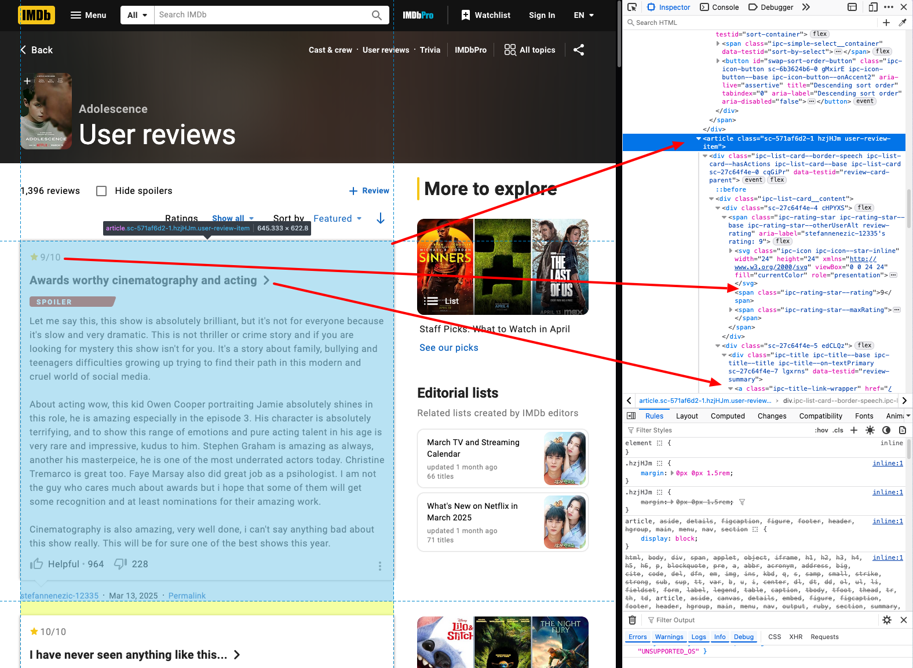

This notebook contains a basic recipe to scrape content from a website using [`{rvest}`](https://rvest.tidyverse.org/) package. For illustrative purposes we will be scrapping this page with reviews from a tv show. Please note that IMBDB has an API that would be more suited for this task.

## Setup

```{r setup, include=FALSE}
knitr::opts_chunk$set(echo = TRUE)

# Uncomment below to install rvest if not ready installed.
# install.packages("rvest")

library(rvest)
# This is the url to scrape
url <- "https://www.imdb.com/title/tt31806037/reviews/?ref_=tt_ururv_sm"

# We load the entire webpage for now and save it in a variable.
html <- read_html(url)
```

## Scrapping a list of references

```{r}
references_list <- html |> 
  html_nodes() |> 
```

## Scrapping all the reviews

The generic code to scrape a table using rvest is as follows

```{r}
html |> 
  html_table()
```

## Getting familiar with the HTML code and structure

To scrape the data that we are looking for we need to understand how the html page is structured. **This is the trickiest part of web scrapping, given that not two websites are identical, and -to make things more complex- the content and structure of a website may change from time to time, we will need to develop custom code for each pages.**

As this is a long page with lots of information, we have to familiarise with the html code and structure to be able to select what we are looking for. To do so, you should enable your web browser's developer tools. An easy way to do this is to:

1.  hover with the mouse over the item you want to scrape
2.  right click with the mouse and select "Inspect"

In our example, we want to select a particular table. If we inspect the table we will see something that looks like that:



This table doesn't have a unique id, which makes it difficult to select. to make things worse, it is not a child of any other element (not nested under a title, for example), so we will need to look for a workaround. In this case we will look for something that is likely to stay unmutable, and start from there. We can look for the heading which has an `id="Lowest_temperatures_recorded"`\`and then select the next table after it.

Rvest works very similar as we'd do with CSS.

## Scrapping

```{r}

# Retrieve the title of the page.
movie_title <- read_html(url) |> 
  html_element("h2") |> 
  html_text()

# Retrieve all reviews
reviews <- read_html(url) |> 
  html_elements("article") 

# Retrieve reviews' ratings.
ratings <- reviews |> 
  html_element(".ipc-rating-star--rating") |> 
  html_text()

# Retrieve reviews' title
titles <- reviews |> 
  html_element("h3") |> 
  html_text()

# Extract reviews' URL
titles_link <- reviews |> 
  html_element(".ipc-title a") |> 
  html_attr("href")

# Extract the actual review.
text <- reviews |> 
  html_element(".ipc-html-content-inner-div") |> 
  html_text()
```

Now , we have different variables containing bits of the information that we are looking for, but it would be better if we stored this into a dataframe, right?

```{r}
# Build a dataframe -------------------------------------------------------

reviews_df <- data.frame(
  titles, 
  titles_link,
  text,
  ratings 
)

reviews_df$movie <- movie_title

# The urls are relative to the scrapped page, so we can 
reviews_df$titles_link <- paste0(url, reviews_df$titles_link)

View(reviews_df)

```

## Further references

-   <https://rvest.tidyverse.org/articles/rvest.html>
-   <https://rvest.tidyverse.org/articles/selectorgadget.html>
-   <https://rvest.tidyverse.org/articles/starwars.html>
